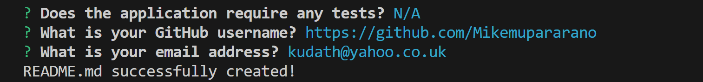

# Professional README Generator

## Description
In this application, I have written code to automate the generation of a professional README that can be deployed on Github pages. I have used Inquirer.js, JavaScript, and Node.js to automate the process of generating README files for projects. Inquirer.js is a powerful library for creating interactive command-line interfaces in Node.js, making it perfect for prompting users for input to generate a README file dynamically. I have created a command-line application that accepts user input.

## Table of Contents
- [Professional README Generator](#professional-readme-generator)
  - [Description](#description)
  - [Table of Contents](#table-of-contents)
  - [Installation](#installation)
  - [Usage](#usage)
  - [License](#license)
  - [Contributing](#contributing)
  - [Credits](#credits)
  - [Tests](#tests)
  - [Questions](#questions)

## Installation
The user is advised to have downloaded and installed node.js from here: https://nodejs.org/en/download/
•	$ npm install
•	$ npm init-y
•	Npm install node.js

## Usage
When a user is prompted for information about the application repository, a high-quality, professional README.md is generated with answering questions based on the following:
•	The title of project, description, table of contents, installation, usage, license, contributing, tests and questions.
•	When a user enters the project title, it's displayed as the title of the README.
•	When a user enters a description, installation instructions, usage information, contribution guidelines, and test instructions, this information is added to the sections of the README entitled Description, Installation, Usage, Contributing, and Tests.
•	When a user chooses a license for their application from a list of options, a badge for that license is added near the top of the README and a notice is added to the section of the README entitled License that explains which license the application is covered under.
•	When a user enters their GitHub username, it's added to the section of the README entitled Questions, with a link to their GitHub profile.

When a user enters their email address, it's added to the section of the README entitled Questions, with instructions on how to reach them with additional questions.

When a user clicks on the links in the Table of Contents, they are taken to the corresponding section of the README.
The inquirer package handles the questions and the user’s input answers.
•	To invoke the application, the user should use the following code:
node index.js
•	The application can be found on this repository link: https://github.com/Mikemupararano/professional-readme-generator
A screenshot of the app is shown here:

The generated README will appear in the 'starter' folder.

## License
This application is covered under the MIT license.

## Contributing
Guidelines for contributing to the project, such as how to report issues, how to submit pull requests, coding conventions, and other information for potential contributors are available on my Github pages: https://github.com/Mikemupararano?tab=repositories

## Credits
I researched website and watched several videos to adapt and work out the code in this web application. I used the following web-links for research and support:
Mike Thomas
(2) https://javascript.plainenglish.io/how-to-inquirer-js-c10a4e05ef1f
(3)https://www.digitalocean.com/community/tutorials/nodejs-interactive-command-line-prompts
(4) https://www.youtube.com/watch?v=o8hkjz1TQuQ
(5) https://www.youtube.com/watch?v=Wt_i73XFb7M
(6) https://github.com/MatWilmot/pizza-order-builder
(7) https://www.youtube.com/watch?v=9YivEQFpmHQ

## Tests
N/A

## Questions
For any questions or concerns, please contact me at [kudath@yahoo.co.uk](mailto:kudath@yahoo.co.uk).
You can also find me on GitHub: [https://github.com/Mikemupararano](https://github.com/https://github.com/Mikemupararano)
