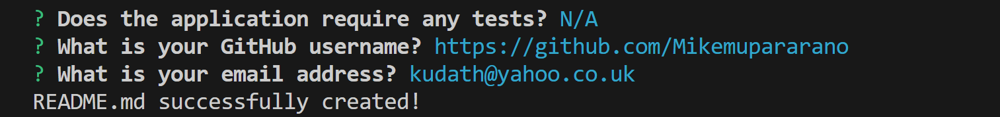

# Professional README Generator

## Description
In this application, I have written code to automate the generation of a professional README that can be deployed on Github pages. I have used Inquirer.js, JavaScript, and Node.js to automate the process of generating README files for projects. Inquirer.js is a powerful library for creating interactive command-line interfaces in Node.js, making it perfect for prompting users for input to generate a README file dynamically.

## Table of Contents
N/A

## Installations
The user is advised to have downloaded and installed node.js from here: https://nodejs.org/en/download/

## Usage
The user is advised to have downloaded and installed node.js from here: https://nodejs.org/en/download/

## License
MIT license- see repository. 

## Contributing
(1) Mike Thomas
(2) https://javascript.plainenglish.io/how-to-inquirer-js-c10a4e05ef1f
(3)https://www.digitalocean.com/community/tutorials/nodejs-interactive-command-line-prompts
(4) https://www.youtube.com/watch?v=o8hkjz1TQuQ
(5) https://www.youtube.com/watch?v=Wt_i73XFb7M
(6) https://github.com/MatWilmot/pizza-order-builder
(7) https://www.youtube.com/watch?v=9YivEQFpmHQ

## Usage 
A screenshot of the work, including the prototype that I used to build this current work is shown here.
A screenshot of the generated readme:

## Credits

## Badges

N/A

## Features

N/A

## Contributing

I would encourage collaboration to improve this web application. Here is the link for any collaborations on this important matter:
https://github.com/Mikemupararano/professional-readme-generator

## Tests

N/A
## Tests
N/A

